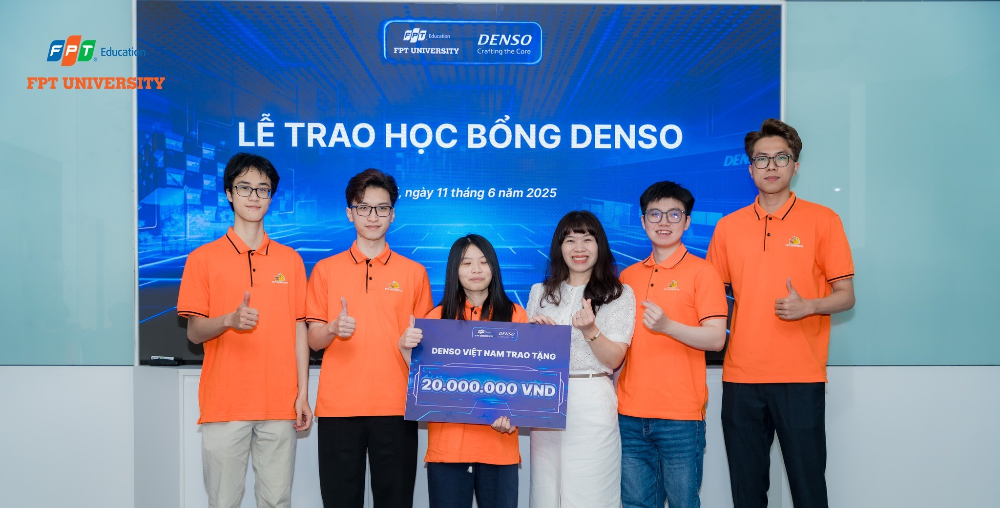

## hi, i'm Chung

> **Back-end Developer**

- Bachelor of Software Engineering at **`FPT University - Hanoi Campus`**
- Hardworking, strong in teamwork, and excellent at time management.
- **`100%`** Scholarship
- **`TOEIC 750` | `JLPT N4`**
- Awarded capstone project scholarship by Denso Vietnam [source](https://www.facebook.com/photo/?fbid=1116264387198490&set=pcb.1116286847196244)

###  Technical Skills

| Category           | Tools & Technologies                            |
| :----------------- | :---------------------------------------------- |
| **Languages**      | Java, JavaScript (TS)                           |
| **Back-End**       | Spring Framework, ExpressJS, NestJS             |
| **Front-End**      | ReactJS, Angular                                |
| **ORM / ODM**      | JPA & Hibernate, Prisma                         |
| **Architecture**   | Microservices, Event-Driven, Clean Architecture |
| **Messaging**      | Kafka, RabbitMQ                                 |
| **DevOps & Cloud** | Docker, Kubernetes, GitHub Actions, GCP(GKE)    |
| **Database**       | MySQL, PostgreSQL, MongoDB, Redis               |

###  Find Me At:

